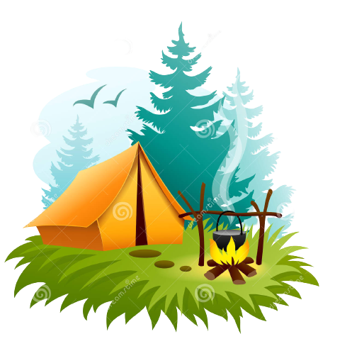

# My travels.

> `My travels` - my travel stories.

---

[Technologies](#technologies) •
[Description](#description) •
[Project setup](#project-setup) •
[Features](#features) •
[How To Use](#how-to-use) •
[Project Status](#project-status) •
[Room for Improvement](#room-for-improvement) •
[License](#license) •
[Contact](#contact)

## Technologies

[//]: # ''
[//]: # ''

## Description

This is a repository of my travel stories.

## Project setup

- Clone this repo to your desktop and run `yarn` or `npm install` to install all the dependencies.
- Once the dependencies are installed, you can run `yarn dev` or `npm dev` to start the application.
- Enjoy.

## Features

-Add Features

## How To Use

...

Run [Live Demo](https://my-travels-iota.vercel.app/)

[//]: # '![tutorial][tutorial]'

## Project Status

Project is: _in progress_

## Room for Improvement

To do:

- [ ] Add Room for Improvement.
- [ ] ...

Improvement:

- [ ] ...

## License

This project is open source and available under the [BSD 3-Clause](../LICENSE.md).

## Contact

Created by [@RimidalU](https://www.linkedin.com/in/uladzimir-stankevich/) - feel free to contact me!

<!-- MARKDOWN LINKS & IMAGES -->

[tutorial]: ./assets/demo.webp
